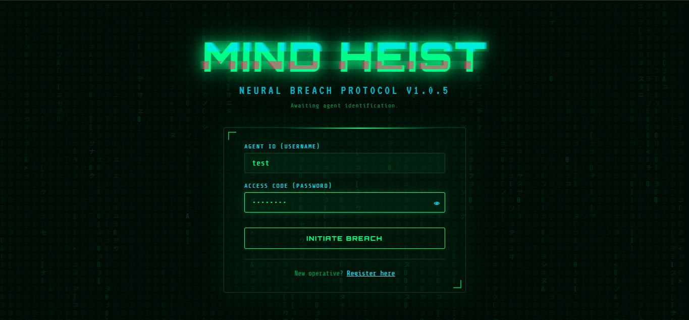
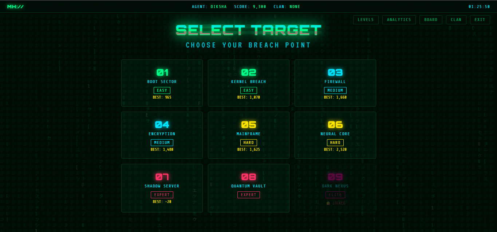
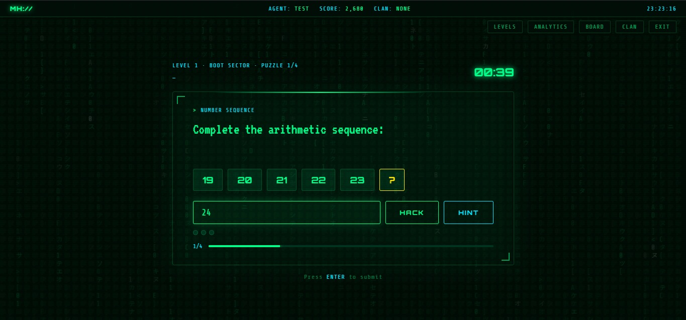
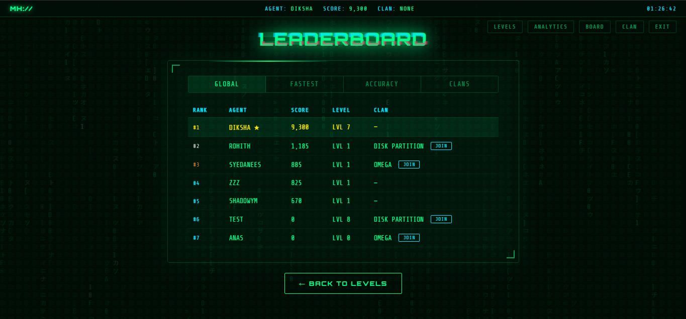
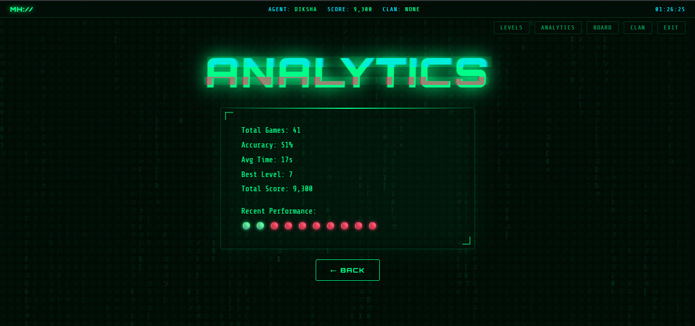
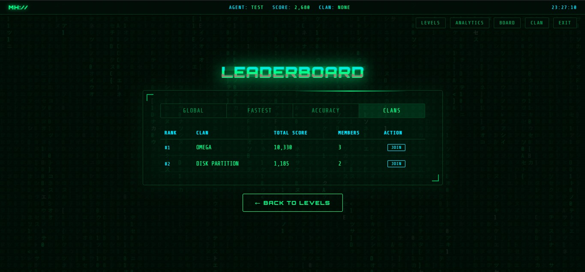
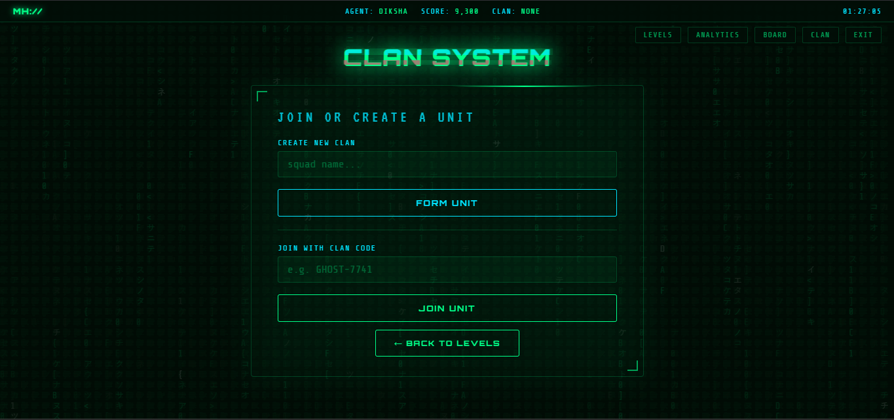

# 🧠 Mind Heist

### A Hacker-Themed Puzzle Game with DBMS Integration

> *"Not just solving puzzles... you're cracking the system."*

---

## 🚀 Project Overview

**Mind Heist** is a hacker-themed puzzle game built using **HTML, CSS, JavaScript, and Supabase (PostgreSQL)**. The game challenges players with progressively difficult logical, mathematical, binary, hexadecimal, and cipher-based puzzles while demonstrating the practical implementation of **Database Management System (DBMS)** concepts.

Unlike a traditional puzzle game, Mind Heist persists user progress, scores, analytics, and clan information in a relational database, making it a complete data-driven web application.

---

## 🌐 Live Demo

Coming Soon (Vercel)

# ✨ Features

## 🎮 Gameplay

- 🧩 9 progressively harder levels (Boot Sector → Dark Nexus)
- 🔢 Dynamic puzzle generation
- ⏱️ Countdown timer with visual warnings
- 💡 Hint system
- ⭐ Score calculation based on correctness and speed
- 🔓 Automatic level unlocking

---

## 📊 Analytics

- Accuracy percentage
- Average solving time
- Total games played
- Best level reached
- Total score
- Recent performance trend

---

## 🏆 Leaderboards

- 🌍 Global Leaderboard
- ⚡ Fastest Players Leaderboard
- 🎯 Accuracy Leaderboard
- 🏴 Clan Leaderboard

---

## 🏴 Clan System

- Create clans
- Join existing clans
- Leave clans
- View clan members
- Automatic clan score calculation

---

## 👤 User System

- Register
- Login
- Auto-login using browser storage
- Session persistence
- Logout confirmation dialog

---

## 🎨 User Interface

- Matrix rain animation
- Cyberpunk hacker theme
- Neon UI
- Responsive layout
- Toast notifications
- Smooth screen transitions
- Glitch text effects

---

# 🛠 Tech Stack

| Technology | Purpose |
|------------|---------|
| HTML5 | Structure |
| CSS3 | Styling & Animations |
| JavaScript (ES6) | Game Logic |
| Supabase | Backend-as-a-Service |
| PostgreSQL | Relational Database |
| Git & GitHub | Version Control |
| Vercel | Deployment |

---

# 📂 Project Structure

```text
Mind-Heist/
│
├── index.html
│
├── css/
│   ├── style.css
│   ├── animations.css
│   ├── leaderboard.css
│   ├── analytics.css
│   └── responsive.css
│
├── js/
│   ├── config.js          # Local configuration (ignored)
│   ├── db.js              # Database layer
│   ├── puzzles.js         # Puzzle engine
│   ├── ui.js              # UI management
│   ├── auth.js            # Authentication
│   ├── game.js            # Gameplay logic
│   ├── leaderboard.js     # Leaderboards
│   ├── analytics.js       # Analytics dashboard
│   ├── clans.js           # Clan management
│   └── app.js             # Application entry point
│
├── assets/
│
├── screenshots/
│
├── config.example.js
├── README.md
└── .gitignore
```

---

# 🗄 Database Schema

## Users

| Column | Description |
|---------|-------------|
| username (PK) | Unique username |
| pass | User password |
| clan | Clan code |
| total_score | Overall score |
| best_level | Highest unlocked level |

---

## Scores

| Column | Description |
|---------|-------------|
| id (PK) | Score ID |
| username (FK) | User |
| level_id | Level |
| score | Level score |

---

## Attempts

| Column | Description |
|---------|-------------|
| id (PK) | Attempt ID |
| username (FK) | User |
| level_id | Level |
| puzzle_index | Puzzle number |
| is_correct | Correct / Incorrect |
| time_taken | Time taken |
| attempts_count | Number of tries |
| ts | Timestamp |

---

## Clans

| Column | Description |
|---------|-------------|
| code (PK) | Clan code |
| name | Clan name |
| total_score | Combined clan score |
| members | Member usernames |

---

# 🧠 DBMS Concepts Demonstrated

The project demonstrates several practical database concepts including:

- Relational Database Design
- Normalization
- Primary Keys
- Foreign Keys
- CRUD Operations
- Aggregation (SUM, AVG, COUNT)
- Sorting (ORDER BY)
- Conflict Resolution (UPSERT)
- Query-based Analytics
- One-to-Many Relationships
- Indexing
- Real-time Data Persistence

---

# ⚙️ Setup Instructions

## 1. Clone the Repository

```bash
git clone https://github.com/r0-vex/Mind-Heist.git
```

---

## 2. Navigate to the Project

```bash
cd Mind-Heist
```

---

## 3. Create `js/config.js`

```javascript
const CONFIG = {
    SUPABASE_URL: "YOUR_SUPABASE_URL",
    SUPABASE_ANON_KEY: "YOUR_SUPABASE_ANON_KEY"
};
```

---

## 4. Configure Supabase

Create the following tables:

- users
- scores
- attempts
- clans

The schema is available in the project documentation.

---

## 5. Run the Project

Simply open

```text
index.html
```

or use **VS Code Live Server**.

---

# 📸 Screenshots

### 🔐 Login
<p align="center">
  
</p>

### 🎮 Level Selection
<p align="center">
  
</p>

### 🧩 Gameplay
<p align="center">
  
</p>

### 🏆 Leaderboard
<p align="center">
  
</p>

### 📊 Analytics Dashboard
<p align="center">
  
</p>

### 🏴 Clan Leaderboard
<p align="center">
  
</p>

### 👥 Clan Management
<p align="center">
  
</p>

# 🔐 Security

This project uses the **Supabase Anon Public Key**, which is intended for client-side applications.

Database access should be protected using **Row Level Security (RLS)** in production deployments.

For educational purposes, this project may use simplified database permissions.

---

# 🚀 Future Enhancements

- 📈 Performance graphs
- 📊 Puzzle category statistics
- 🧠 AI-generated puzzles
- 🎮 Multiplayer battles
- 🏅 Achievement badges
- 🌍 Global events
- 🔒 Full Supabase Authentication
- 🛡 Row Level Security (RLS)
- 📱 Progressive Web App (PWA)
- 🌐 Multiplayer clan wars

---

# 📚 Learning Outcomes

Through this project we implemented:

- Frontend development using HTML, CSS and JavaScript
- Backend integration using Supabase
- Relational database management
- SQL queries and aggregation
- CRUD operations
- User authentication
- Data visualization
- Modular JavaScript architecture
- Responsive web design
- Git and GitHub workflow

---

# 👨‍💻 Authors

**Rohith**

**Diksha**

---

# 📄 License

This project is licensed under the **MIT License**.

---

⭐ If you found this project interesting, consider giving it a **Star** on GitHub!